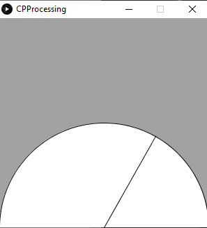
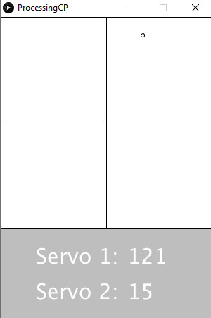

# Expert_CircuitPython
This repository contains all of my Expert CircuitPython assignments. 

## Hello Processing
#### Goal:
For this assignment, the goal was to get familiar with a new language and figure out how to use it. Processing is a tool that allows you to create pretty great graphic user interfaces that can display data wonderfully. In this assignment, we were introduced to processing and had to draw a circle that would bounce around the window when it hit the sides. 
#### Lessons Learned:
While trying to accomplish this, I learned how important it is to use all of your resources, especially google, when trying something new. There are amazing websites that can tell you how to draw pretty much anything in Processing, and I found those extremely helpful when working in a language I knew nothing about. 

A helpful website: https://processing.org

 

## CircuitPython to Processing
#### Goal:
The goal of CircuitPython to Processing was to gather data through a potentiometer in CircuitPython and then send that data to processing and display it on a speedometer.
#### Lessons Learned:
In this assignment, we were introduced to UART (which is Universal Asynchronous Reciever/Transmitter), and had to figure out how to wire it and use it. The UART cable plugs into the metro and allows for another serial port to be used. The UART cable uses the TX and RX ports on the metro as well as 3.3V and ground.
In addition, there was some tricky math that had to be done to make sure that the the line in the speedometer. The line needed to go from 0-300 (x-values) and 300-180-300 (y-values) in a semi-circle fashion, which greatly resembles sine and cosine curves. The data from the potentiometer was mapped to go from 0-180.

 

## Processing to CircuitPython
#### Goal:
The goal of this assignment was to create a GUI(graphical user interface) where you could move the mouse to different locations on a graph and servos would move to corresponding angles. In addition, the data from the mouse was collected in processing and sent over UART to VS Code (CircuitPython) where the servos were controlled.
#### Lessons Learned:
Again in this assignment, it was extremely important to use resources such as google to figure out how to draw things new to me in processing. I also used my resources to figure out that there are functions available in processing that will give you the coordinates of the mouse to use in calculations. Getting the string to print correctly in processing was relatively easy, but getting it to transfer and be read correctly in circuitpython was really hard. One thing I found was the importance of being patient in yur troublshooting, and not changing multiple things at once, because then you don't know which change caused/fixed a problem. In addtion, my biggest problem was that I didn't sync my delays. My processing code would be sending data to the circuitpython side much faster than it was being read, causing errors and mistranslations. This could be fixed by reading the data I was getting on the serial monitor very carefully and calculating how fast each portion of code was running.

 
