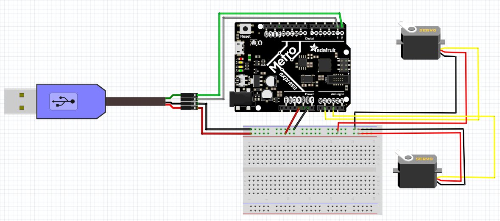

# Expert_CircuitPython
This repository contains all of my Expert CircuitPython assignments. 

## Hello Processing
For this assignment, the goal was to get familiar with a new language and figure out how to use it. Processing is a tool that allows you to create pretty great graphic user interfaces that can display data wonderfully. In this assignment, we were introduced to processing and had to draw a circle that would bounce around the window when it hit the sides. While trying to accomplish this, I learned how important it is to use all of your resources, especially google, when trying something new. There are amazing websites that can tell you how to draw pretty much anything in Processing, and I found those extremely helpful when working in a language I knew nothing about. 

A helpful website: https://processing.org

 

## CircuitPython to Processing

## Processing to CircuitPython

