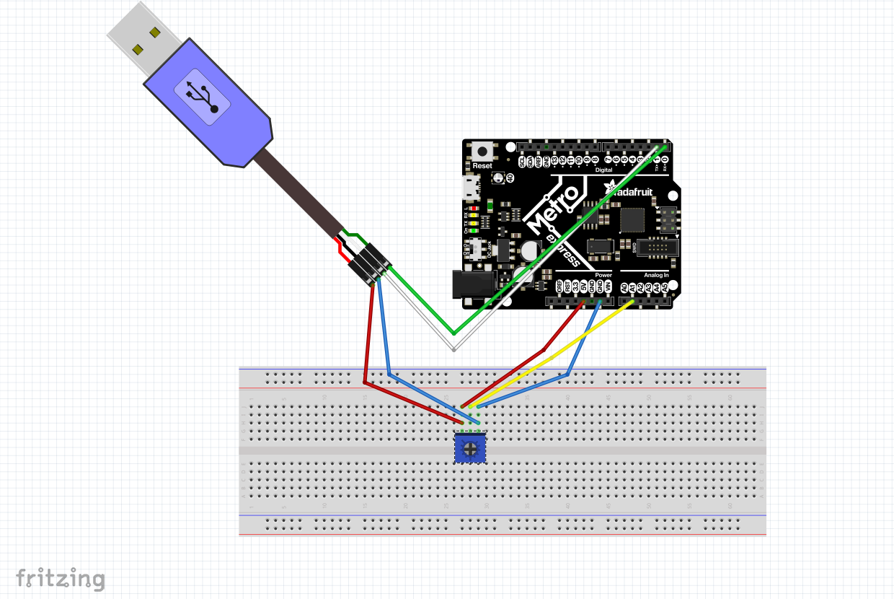

# Expert_CircuitPython
This repository contains all of my Expert CircuitPython assignments. 

## Hello Processing
For this assignment, the goal was to get familiar with a new language and figure out how to use it. Processing is a tool that allows you to create pretty great graphic user interfaces that can display data wonderfully. In this assignment, we were introduced to processing and had to draw a circle that would bounce around the window when it hit the sides. While trying to accomplish this, I learned how important it is to use all of your resources, especially google, when trying something new. There are amazing websites that can tell you how to draw pretty much anything in Processing, and I found those extremely helpful when working in a language I knew nothing about. 

A helpful website: https://processing.org

 

## CircuitPython to Processing
The goal of CircuitPython to Processing was to gather data through a potentiometer in CircuitPython and then send that data to processing and display it on a speedometer.
In this assignment, we were introduced to UART (which is Universal Asynchronous Reciever/Transmitter), and had to figure out how to wire it and use it. The UART cable plugs into the metro and allows for another serial port to be used. The UART cable uses the TX and RX ports on the metro as well as 3.3V and ground.
In addition, there was some tricky math that had to be done to make sure that the the line in the speedometer. The line needed to go from 0-300 (x-values) and 300-180-300 (y-values) in a semi-circle fashion, which greatly resembles sine and cosine curves. The data from the potentiometer was mapped to go from 0-180.

 

## Processing to CircuitPython

 
